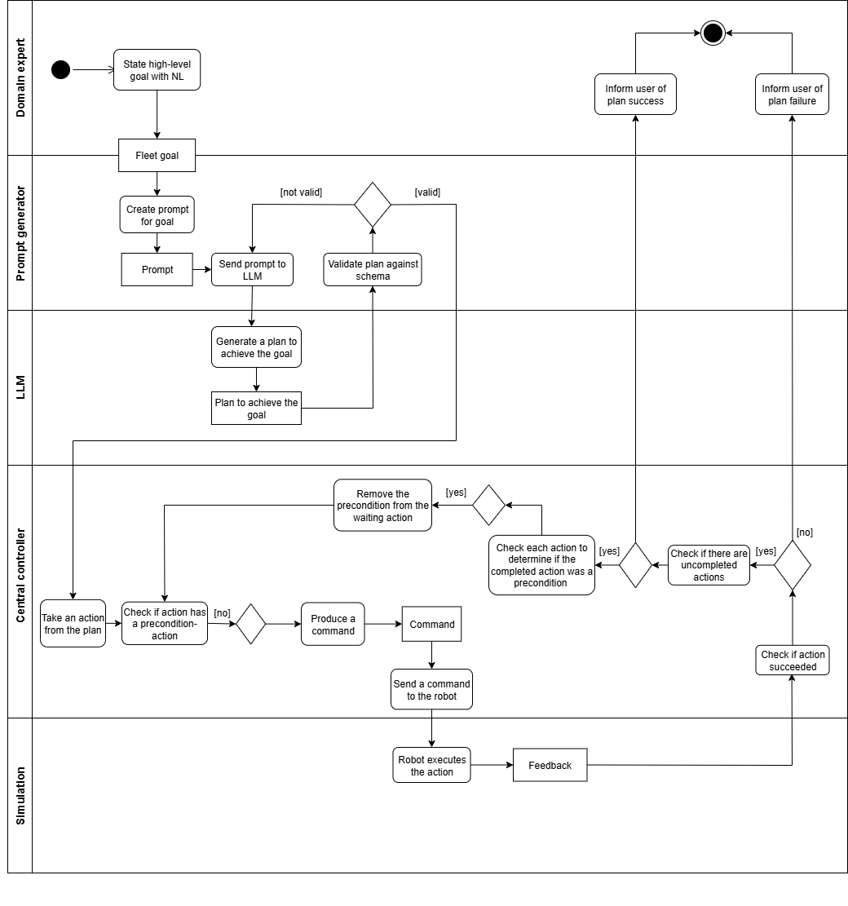

# Mixed Fleet WP2

## Programming robotic fleets utilising large language models

This repository contains research code for the Mixed Fleet project
researched at Tampere University. The work is associated
with **Work Package 2: Programming Multi-Machine Fleets (WP2)** of the project which you can read more about [here](https://blogs.tuni.fi/cs/projects/mixed-fleet-cross-disciplinary-work-towards-seamless-collaboration-between-mobile-work-machines-and-humans/). The aim of the code in this repository is to provide a proof-of-concept about leveraging Large Language Models in the programming of robotic fleets. Blog post concerning the subject can be read [here](https://blogs.tuni.fi/cs/projects/first-steps-towards-programming-mixed-fleet-systems-by-domain-experts/).

**This document will be continously updated during the course of the project**

## Preface

On the high-level, implementation consists of two distinct parts: **The graphical user interface** through
which a user may write a goal that a robotic fleet must complete
and the **Gazebo simulation** environment where a plan provided by the LLM may be executed and examined. The mentioned
components can be seen in the image below.
[ATTACH IMAGE HERE]
The process begins with the user writing a high-level goal that they desire the robots to complete. This can be for example:
_"Move a pallet from a rack the storage area"_. The system then internally creates a prompt for the LLM. The different parts
of the prompt can be seen in picture 2. The LLM produces a suitable plan to achieve the goal which then validated
against a JSON schema. After validation, the **system orchestrator** schedules the actions specified in the plan
and sends appropriate commands to the robots in the simulation environment. The robots then send feedback back to the orchestrator
about completed and failed actions. The complete workflow and the different responsibilities of the systemns are illustrated in the flowchart below.

